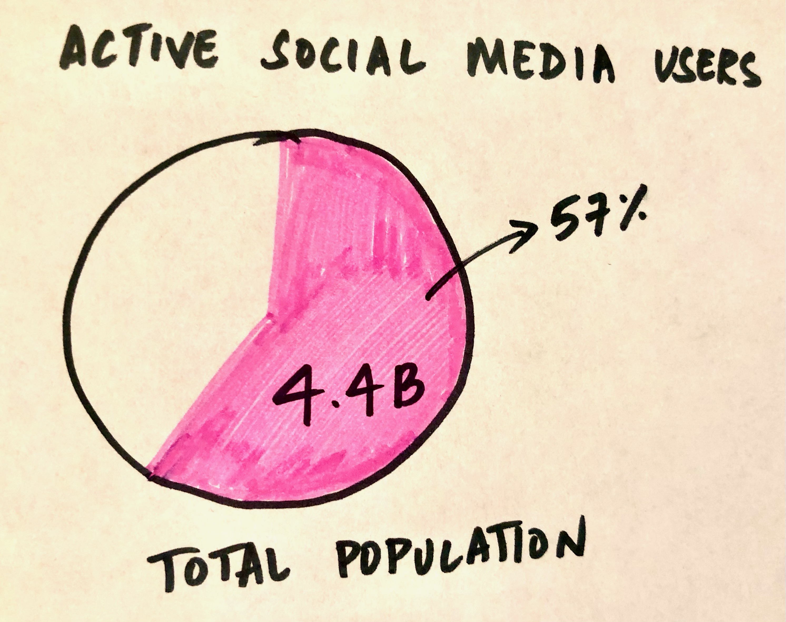

# Let's do something about Misinformation on Social Media

[Back to Main](/README.md)

## Summary
Social media (Facebook, Twitter, Instagram etc.) is a powerful tool, and has more or less changed the way we communicate. The number of users on these platforms have been steadily increasing through the years, and there are no rules that govern engagement.   I want to talk about about an (unanticipated?) side-effect that has serious and negative impacts on society outside of this virtual world. My aim is to create awareness, to encourage people to talk about **Misinformation & Fake News on Social Media**, and help them to make better decisions when they go online.

## Structure
I want to take the audience through a journey as follows,
* First, I want to establish the pervasiveness and strength of social media.
* Then, some statistics about the number of people getting their news (and trusting it) from social media. 
* Walk the audience through some examples: Case studies - the 2016 US Elections & the Covid-19 pandemic.
* Conclusion - How can we combat misinformation? What is Big Tech doing about it? What can governments do?

## Initial Sketches
For the first part of my project, I want to show the power of social media.  
 
I have sketched out two charts, one showing the proportion of active social media users against the total world population and the other showing the percentage of internet users who are on social media. 

 
 

 

The next sketch shows a line chart of growing usage of social media in both young adults and the aged population since 2005. 
 
 
 

This one breaks down the source of news of the surveyed US Adults. I want to highlight the high percentage of people getting their news from social media.
 

 

## Data
I have identified the following sources of data that I can use for my story.  

#### Pew Reseach Center:
* [Social Media Fact Sheet](https://www.pewresearch.org/internet/fact-sheet/social-media/)
* [Social Media Usage](https://www.pewresearch.org/internet/wp-content/uploads/sites/9/2021/04/PI_2021.04.07_Social-Media-Use_TOPLINE.pdf)
* [Social Media as News Source](https://www.pewresearch.org/journalism/wp-content/uploads/sites/8/2021/01/PJ_2021.01.12_News-and-Social-Media_TOPLINE.pdf)

The Pew Research Center data consists of two surveys and the questions revolve around social media usage habits such as the sites the respondents use, how often and how much time they generally spend on social media. The other survey asks about how the respondents stay up to date with current affairs and if they trust the news on social media. The fact sheet contains data on the number of users of the various social media platforms through the years, the demographics etc. These three sources can be used to show the power and growing popularity of social media, the number of people who rely on it to stay up to date on events etc. which will form the first part of my project.

#### Statista:
* [Number of Users](https://www.statista.com/statistics/278414/number-of-worldwide-social-network-users/)
* [Social Media as News Source](https://www.statista.com/statistics/718019/social-media-news-source/)
* [Big Tech combating covid misinformation](https://www.statista.com/statistics/1258831/us-adults-share-social-media-companies-coronavirus-vaccine-misinformation/)
* [Fake news about Covid](https://www.statista.com/statistics/1105067/coronavirus-fake-news-by-politics-us/)

The Statista data can be used to back up the Pew Research data for the number of users and social media as a news source. I also found data that can support the case studies on misinformation revolving Covid and the 2016 elections. 

#### Buzzfeed News
* [Fake News - Election, Content Engagement](https://docs.google.com/spreadsheets/d/1ysnzawW6pDGBEqbXqeYuzWa7Rx2mQUip6CXUUUk4jIk/edit#gid=399992108)

The Buzzfeed News data can be used to show the impact and widespread nature of fake news, especially during the election period. 

## Method and Medium
* Research - identify articles and news stories that talk about real-life incidents as a result of fake news on social media to back up my claim.
* Data Viz - use the data I have gathered to make powerful visualizations to reinforce my message.
* Writeup - I do not want the writeup to be very long; I want it to support the data and mostly allow the data to talk for itself.
* Call-to-Action - I have to think through and finalize my call-to-action.
* More data - I would like to find more data regarding people's opinion on government regulation of social media in countries around the world to come up with my recommendation in the conclusion. I also want to find some data to show that raising awareness in teenagers through mandatory courses in school and having publicly accesible information about misinformation (eg. short videos on YouTube) could make a huge difference in the fight against misinformation in years to come.
* Medium for Final Presentation - I plan on using Shorthand for the final presentation. And have a more detailed copy of it on myGitHub page, including this draft version of the project. 

